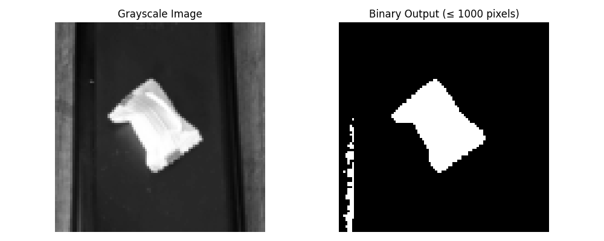
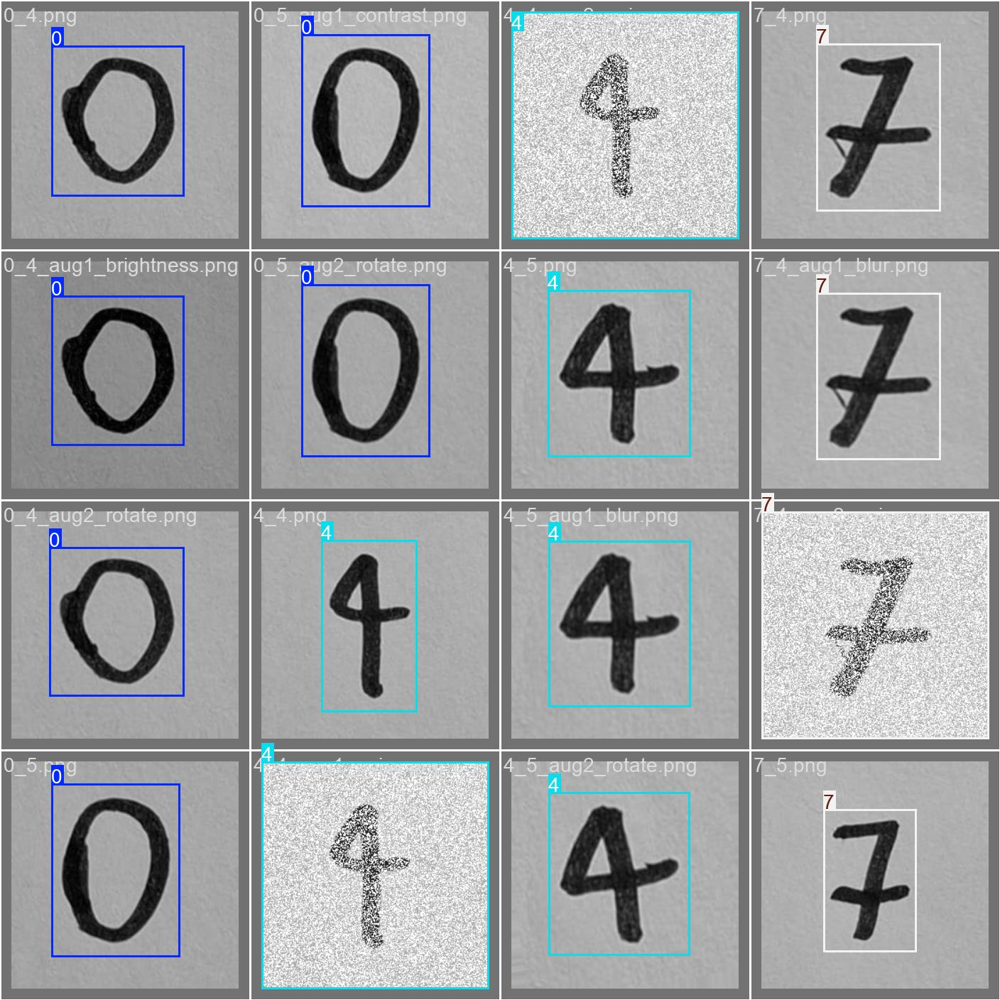
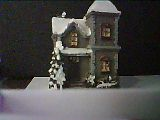
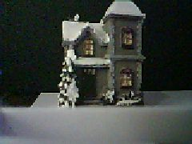
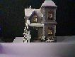

# Embedded Digital Image Processing - Final Project

**Course:** EE-4065 Embedded Digital Image Processing  
**Institution:** Marmara University, Department of Electrical and Electronics Engineering

## Authors

- **Rüzgar Batı Okay** - Student No: 150722048
- **Semih Yıldız** - Student No: 150721029

## Project Overview

This project implements three image processing tasks on the ESP32-CAM microcontroller:
1. **Question 1:** Histogram-based adaptive thresholding for object extraction
2. **Question 2:** Handwritten digit detection using YOLOv8 (digits 0, 4, 7)
3. **Question 3:** Image resizing using nearest-neighbor interpolation (upsampling 1.5x, downsampling 2/3)

## Project Structure

```
.
├── esp32_cam_link/          # ESP32-CAM Arduino code
│   ├── esp32_cam_q1/       # Question 1: Thresholding
│   ├── esp32_cam_q2/       # Question 2: YOLO model files
│   └── esp32_cam_q3/       # Question 3: Image resizing
├── python/                  # Python implementations and training
│   ├── q1.py               # Question 1: Thresholding algorithm
│   ├── q3.py               # Question 3: Resizing algorithm
│   ├── question1_images/  # Question 1 AND 3 test images, kept the same folder name
│   └── question2_new/     # Question 2: YOLO training and inference
├── EE4065_Project_Rüzgar_Batı_Okay_150722048_Semih_Yıldız_150721029.pdf
├── report_images/          # Project result images
│   ├── binary.png
│   ├── figure_grayscale_versus_binaryoutput.png
│   ├── q3_comparison.png
│   ├── reference_taken_from_phone.jpg
│   ├── resized-downsampled.jpg
│   ├── resized-normal.jpg
│   └── resized-upsampled.jpg
└── requirements_*.txt     # Python dependency files
```

## Image Locations

All project result images are located in `report_images/`:

### Question 1 Results

**Reference Image (sugar cube on calculator case):**


**Grayscale vs Binary Comparison:**


**ESP32-CAM Binary Output:**


### Question 2 Dataset and Labels

**Dataset sample used for training/testing (handwritten digits 0, 4, 7):**


**Validation labels example from best experiment:**


### Question 3 Results

**Python Comparison (original, upsampled, downsampled):**


**ESP32-CAM Results:**

Original Image (1:1 scale):


Upsampled Image (1.5x):


Downsampled Image (2/3 scale):


## Requirements Files

### `requirements_question1.txt`
Dependencies for Question 1 (thresholding):
- `pyserial` - Serial communication with ESP32-CAM
- `numpy` - Numerical operations for image processing
- `Pillow` - Image loading and manipulation
- `matplotlib` - Visualization of results

**Usage:** Install with `pip install -r requirements_question1.txt`

### `requirements_question3.txt`
Dependencies for Question 3 (image resizing):
- `pyserial` - Serial communication with ESP32-CAM
- `Pillow` - Image loading and manipulation
- `matplotlib` - Visualization of comparison results

**Usage:** Install with `pip install -r requirements_question3.txt`

### `requirements_py311.txt`
Dependencies for Question 2 (YOLO training and inference):
- `torch`, `torchvision` - PyTorch framework for deep learning
- `ultralytics` - YOLOv8 implementation
- `numpy` - Numerical operations
- `opencv-python` - Computer vision operations
- `pillow` - Image processing
- `pandas` - Data handling for metrics
- `albumentations` - Data augmentation

**Usage:** Install with `pip install -r requirements_py311.txt` (Python 3.11 recommended)

### `requirements_tflite_310.txt`
Dependencies for TensorFlow Lite model conversion (Question 2):
- `torch`, `torchvision` - PyTorch framework
- `ultralytics` - YOLOv8 implementation
- `tensorflow-intel`, `keras` - TensorFlow for model conversion
- `numpy`, `opencv-python`, `pandas` - Supporting libraries

**Usage:** Install with `pip install -r requirements_tflite_310.txt` (for model export to TFLite format)

## Hardware

- **ESP32-CAM** (AI Thinker module) with OV2640 camera
- **USB-to-Serial FTDI adapter** for programming and communication
- **Jumper wires** for connections

## Report

The LaTeX report source files are located in `report/`. See `report/README.md` for compilation instructions.

**Compiled PDF Report:** `EE4065_Project_Rüzgar_Batı_Okay_150722048_Semih_Yıldız_150721029.pdf` (located in the project root directory)

